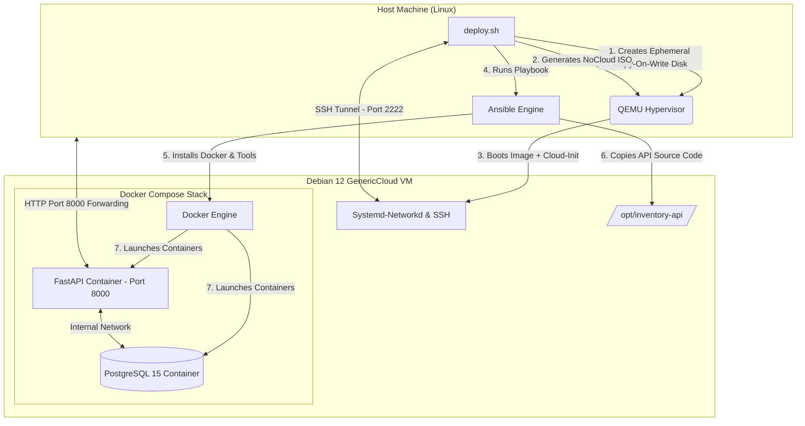

# 🚀 Zero-Touch IaC Infrastructure & API Deployment Pipeline

An automated Infrastructure as Code (IaC) and deployment pipeline for a cloud-based **Debian 12 Virtual Machine** running a containerized **FastAPI and PostgreSQL** backend stack. 

Built with **QEMU/KVM**, **Cloud-Init**, **Ansible**, **Docker Compose**, and **uv**.

---

## 🏛️ Architecture Overview

The pipeline executes an automated workflow: it provisions an ephemeral virtual machine, configures early-boot networking and user access, provisions software packages via Ansible, and deploys the containerized application via Docker Compose.



## 🛠️ Tech Stack

- Virtualization & Provisioning: QEMU/KVM, Cloud-Init (NoCloud ISO format), Debian 12 GenericCloud image (qcow2).

- Configuration Management: Ansible (Apt management, Systemd services, repository setups, tar extraction).

- Containerization & Orchestration: Docker Engine, Docker Compose Plugin.

- Backend Application: Python 3.11, FastAPI, PostgreSQL 15 Alpine, uv package manager, Telegram Bot API.

## 📋 Prerequisites

Ensure your Linux host has the required virtualization and automation tooling installed:
Debian / Ubuntu

```bash
sudo apt update && sudo apt install -y qemu-system-x86 qemu-utils cloud-image-utils ansible curl
```

Arch Linux
```bash
sudo pacman -S qemu-full cloud-utils ansible curl
```

## 🚀 Quickstart Guide (Zero-Touch)
1. Clone the Repository (with Submodules)

Because the application layer is linked as a Git Submodule, clone using --recurse-submodules:

```bash
git clone --recurse-submodules [https://github.com/tu-usuario/infra-lab-inventory.git](https://github.com/glenngoitiasa-byte/infra-lab-inventory.git)
cd infra-lab-inventory
```

2. Run Automated Deployment

Execute the master deployment script. It will automatically download the Debian base image if not present, spin up the VM, and execute the Ansible playbook:

```bash
chmod +x deploy.sh destroy.sh
./deploy.sh
```

## 🧪 Verification & Endpoints
Once the deployment finishes:

- Interactive OpenAPI Docs (Swagger): (http://localhost:8000/docs)

- Check Product List via CLI:

    ```bash
    curl -s http://localhost:8000/products/ | jq
    ```

- Simulate Stock Output (Triggers Telegram Alert if below minimum):
    
    ```bash
    curl -X POST "http://localhost:8000/products/1/output?quantity=2"
    ```

- SSH into Virtual Machine:

    ```bash
    ssh -o StrictHostKeyChecking=no -o UserKnownHostsFile=/dev/null -p 2222 sysadmin@127.0.0.1
    ```

## 🛑 Environment Teardown

To stop the QEMU instance and clean up ephemeral disk images and temporary build files:

```console
./destroy.sh
```
